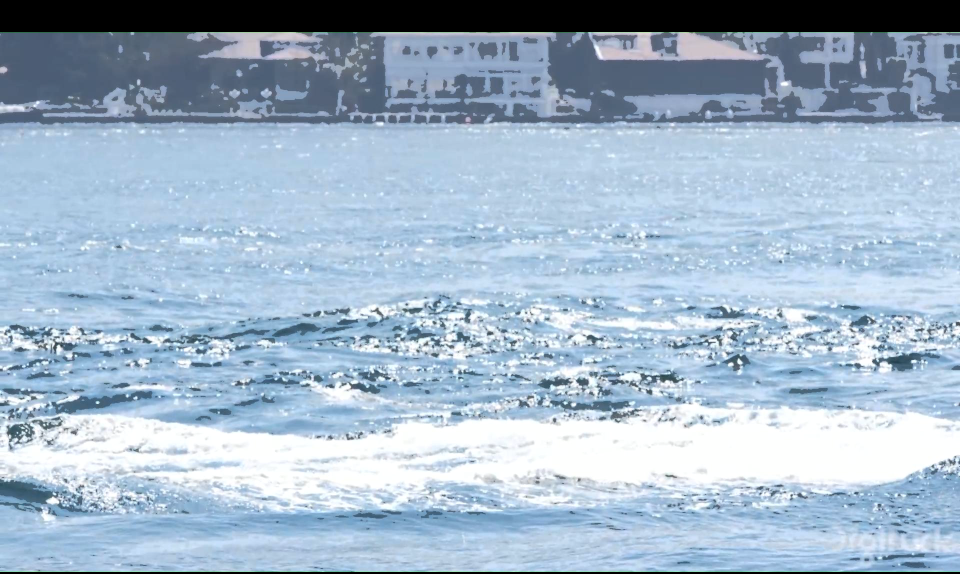
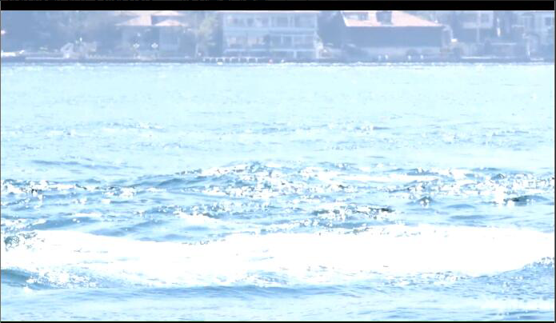

## HDR视频闪烁优化

仅使用亮度均值调整算法仍不能完全避免视频的闪烁问题，尤其是一些亮度变化较大的视频，同一场景内亮度变化时被亮度均值调整算判断为场景的改变，从而没有得到亮度的矫正。更严重的情况下有可能使视频局部失真，比如下面这张图中背景房屋的失真：



为处理这种情况可以从两个方面入手：

### 亮度均值的计算：

亮度均值调整算法的核心就是根据各个帧之间的每个像素亮度的均值判断是否需要进行调整，以及确定调整的数值。但在均值计算的过程中可能会受到一些极端值的影响，比如游船行驶的测试视频中，水花部分的亮度明显较大，而船身的亮度又很小，这样计算出来的亮度均值难免会受到它们的影响。以至于在船身离开画面后，闪烁的情况突然加剧。

因此在取均值的过程中，我们加入了过滤极端值的优化，避免了亮度过高或过低的像素对整体的处理效果产生不好的影响，下面的代码就是将各个画面中亮度最大和最小的5个值去除后再求均值：

```matlab
origin_hsv = rgb2hsv(double_origin_img);
v_channel = origin_hsv(:, :, 3);
v_channel = v_channel(:);

m = sort(v_channel);
for i = 1 : 5
    m(find(m==min(m))) = [];
    m(find(m==max(m))) = [];
end;
result = mean(m);
```

### Lmax参数的选取：

我们所采用的HDR图像处理方法中需要用到的一个较重要的参数是`Lmax`。它是一个构造出来的参数，表示LDR图像中的像素最大值映射到HDR图像中的像素值的大小，即得到的HDR图像的亮度上限。它的取值会影响到最终图像的整体亮度。对于视频来说，它是会引起闪烁情况的因素之一。

Lmax的动态变化可以体现在两个方面，首先是不同的视频，整体亮度不同，适合的Lmax范围也不同，对于整体较暗的视频，Lmax的取值可以相对大一些，以提升整体的画面亮度，反之亦然。经过对多个测试视频的尝试后，我们发现将Lmax的取值范围定在[1.3, 1.6]之间是对多数视频比较合适的。

第二个方面是同一个视频中每一帧的亮度不同，因此用静态的Lmax可能会出现闪烁。我们的优化方法是求出每一帧的亮度均值，得到所有帧的亮度均值范围，再将每一帧的平均亮度线性映射到Lmax的[1.3, 1.6]范围上，得到适合于每帧的动态Lmax：

```matlab
%求平均亮度
averVideo = zeros(1, frames);
parfor k = startFrame : frames
    aver_bright = aver_brightness(['./../Cache/originFrame/', sprintf('%04d',k), '.bmp']);
    disp(['No. ', sprintf('%04d',k), 'averbrightness: ', sprintf('%f',aver_bright)]);
    averVideo(k) = aver_bright;
end
%平均亮度的极值
min_aver = min(averVideo);
max_aver = max(averVideo);
%动态的Lmax
parfor k = startFrame : frames
	Lmax = 1.3 + (1.6 - 1.3) / (max_aver - min_aver) * (averVideo(k) - min_aver);
	......
end
```

经过上述处理后，相同视频的闪烁情况得到大幅改善：



