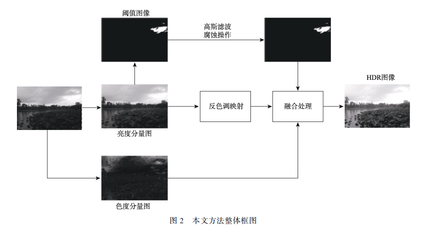
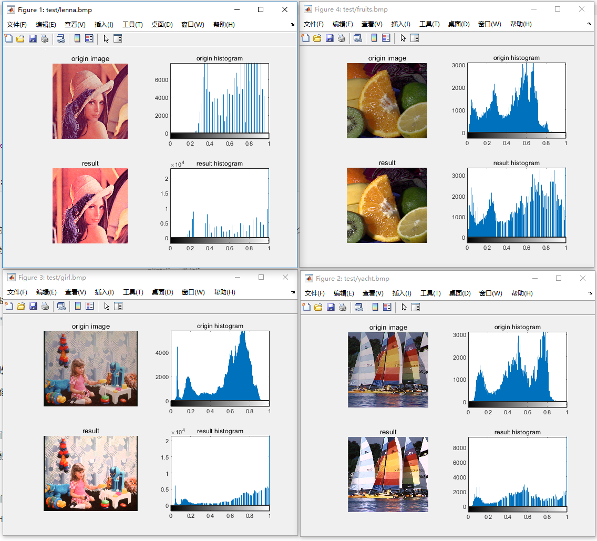
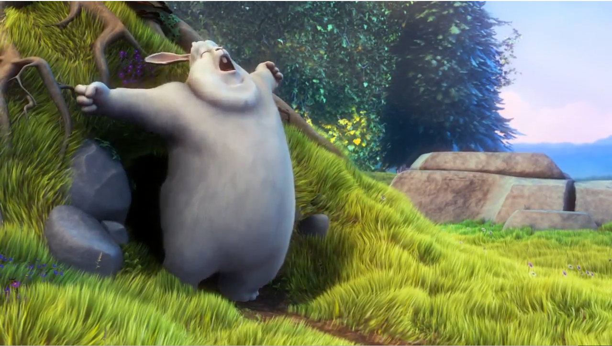
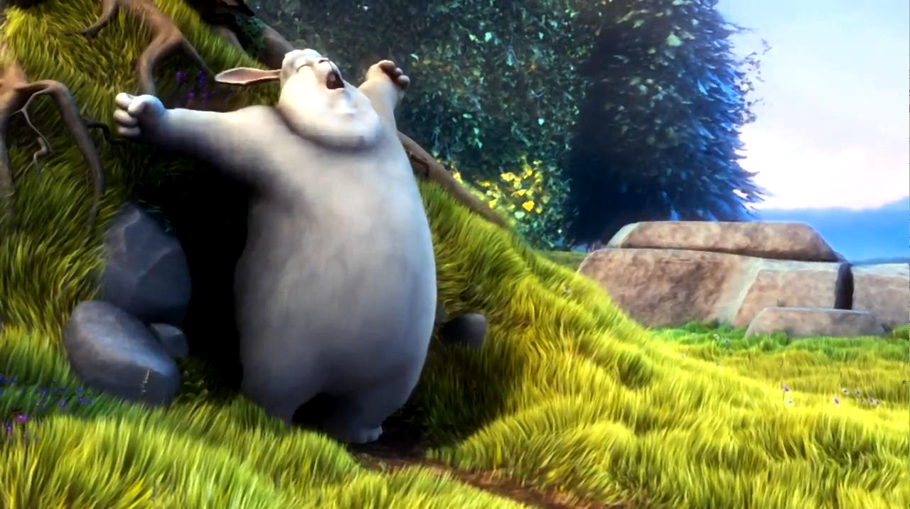
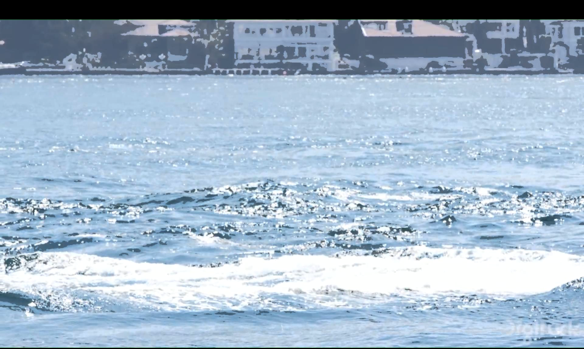
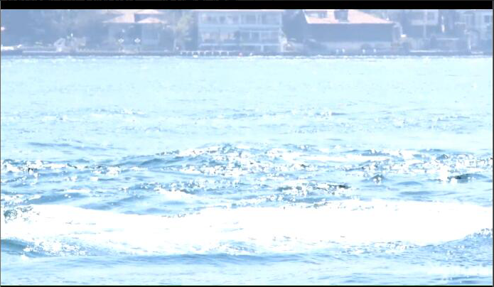

# HDR图像及视频处理

小组成员及分工：

- 16340028陈思航：HDR图像处理
- 16340076胡嘉鹏：HDR视频处理
- 16340032陈统盼：HDR视频处理优化及测试


## HDR图像部分

本次项目的HDR图像生成是基于单幅图像，利用HVS颜色空间模型进行高动态范围图像的生成。在该种方法中，主要运用三个部分[1]：

- 对图像亮度分量的反色调映射
- 对亮度分量求取阈值图像并进行高斯滤波保留高光部分细节
- 将前两部分处理得到的图像与色度分量图融合处理，在融合的同时对图像进行最后的色调调整和对比度优化。



### 预处理：中值滤波

使用中值滤波可以避免椒盐噪声的影响。椒盐噪声是图像传感器、传输信道、解码处理等环节产生的黑白相间的噪声。利用中值滤波器进行亮度通道的处理，即对应像素点亮度值等于其8领域内（包括其本身）亮度值的中值，可以在较少信息损失的情况下进行噪声处理。

在matlab进行如下代码实现：
```matlab
 %%-----添加预处理去噪----------------
    tmp = v_channel;
    [m, n] = size(v_channel);
    for i = 1 : m - 3 + 1
        for j = 1 : n - 3 + 1
            list = v_channel(i : (i + 3 - 1), j : (j + 3 - 1));
            list = list(:);
            tmp(i + (3 - 1)/2, j + (3 - 1)/2) = median(list);
        end
    end
    v_channel = tmp;
```


### 将图像的RGB颜色空间转换到HSV颜色空间

在人眼的视网膜中，有大量的锥状细胞和杆状细胞，其中锥状细胞对亮光明暗而对于暗光不敏感，同时对颜色信息敏感且分辨率较高；而杆状细胞对暗光明暗却对颜色信息不敏感。所以使用HSV（也可以称作HVS）颜色空间，其包括色相、饱和度和亮度通道，模拟了人眼对于外界颜色、光线的感知方式，可以通过如下公式将图像的RGB空间和HSV空间互相转换：

RGB转HSV：
$$
R' = \frac{R}{225} \\
G' = \frac{G}{225} \\
B' = \frac{B}{225} \\
C_{max} = max(R', G', B')\\
C_{min} = min(R', G', B')\\
\delta = C_{max} - C_{min}\\
H =
\begin{cases}
0, & \delta = 0 \\
60° × (\frac{G'-B'}{\delta} + 0), & C_{max} = R' \\
60° × (\frac{B'-R'}{\delta} + 2), & C_{max} = G' \\
60° × (\frac{R'-G'}{\delta} + 4), & C_{max} = B' \\
\end{cases} \\
S =
\begin{cases}
0, & C_{max} = 0 \\
\frac{\delta}{C_{max}}, & C_{max} \neq0 \ \\
\end{cases}\\
V = C_{max}
$$


HSV转RGB：
$$
条件：0\leq H < 360, \qquad  0\leq S \leq 1  \qquad and \qquad  0 \leq V \leq 1 \\
C = V×S\\
X= C ×(1 - |\frac{H}{60°}mod\,2 - 1|)\\
m = V -C\\
(R', G', B) =
\begin{cases}
(C,X,0), & 0°\leq H < 60° \\
(X,C,0), & 60° \leq H < 120° \\
(0,C,X), & 120° \leq H < 180° \\
(0,X,C), & 180° \leq H < 240° \\
(X,0,C), & 240° \leq H < 300\\
(C,0,X), & 300° \leq H < 360°\\
\end{cases} \\
(R,G,B) = ((R' + m)×255,(G' + m)×255,(B' + m)×255 )
$$
在matlab中，可以使用其工具箱进行颜色空间的转换。

RGB转HSV：

```matlab
% 转化为double类型
    double_origin_img = im2double(origin_img);
    origin_hsv = rgb2hsv(double_origin_img);
```


HSV转RGB：

`result = hsv2rgb(origin_hsv);`

### 亮度分量的反色调处理

我们将HDR图像数据映射到LDR图像成为色调映射，而将LDR图像映射到HDR图像的过程成为反色调映射。通过如下反色调映射算子可以得到反色调映射的结果：
$$
L_w(x, y) = \frac{1}{2}L_{max} \cdot L_{white}((L_d(x, y) - 1) + \sqrt((1 - L_d(x, y))^2 + \frac{4L_d(x, y)}{L_{white}^2}))
$$
其中`Lmax`为LDR图像像素亮度最大值映射到HDR图像中值的大小，而`Lwhite`一般被赋值为`Lmax`，对于`Ld(x, y)`为LDR图像对应位置的亮度值，`Lw(x,y)`为HDR图像对应位置的亮度值。在项目中，我们将L_max取值为2.5，也就是说，其亮度值为LDR图像最大亮度值的2.5倍。


在Matlab中，我们通过如下代码实现：

```matlab
function transform_v = inverse_mapping(norm_v, Lmax)
    [m,n] = size(norm_v);
    transform_v = norm_v;
        for i = 1: m
            for j = 1 : n
                transform_v(i, j) = 0.5 * Lmax^2 * ((norm_v(i, j) - 1) + sqrt((1 - norm_v(i, j))^2 + 4 * norm_v(i, j) / Lmax^2));
            end
        end
%     imtool(transform_v);
    % 最后将v通道归一化，因为范围为[0, 1]
    %      transform_v = normalize(transform_v, 0.0, 1.0);
end
```

只需要将原LDR图像进行遍历即可。

### 高光区域处理

因为LDR图像中高光区域可能出现细节丢失、噪声增加的情况，所以需要对丢失的信息进行你不，这里通过单阈值处理、高通滤波器以及高斯滤波器进行高光区域的处理。主要有三个步骤：

- 单阈值处理
- 腐蚀操作
- 高斯滤波

#### 单阈值处理

对于设定的阈值e，如果亮度通道对应位置的值大于e则保留，小于e则取0。在项目中我们将e取为0.94。
$$
M(p) =
\begin{cases}
I_{dmax}, & I(p) > \varepsilon \\
0, & others \\
\end{cases} \\
$$


```matlab
 % 进行阈值处理    
    max_light = max(max(norm_v));
    e = threshold_val * max_light;
    [m,n] = size(norm_v);
    Mp = norm_v;
    for i = 1: m
        for j = 1 : n
            if norm_v(i, j) < e
                Mp(i ,j) = 0.0;
            end
        end
    end
```

#### 腐蚀操作

为了避免高光区域像素点亮度值对于周围低亮度值像素点的影响，我们需要进行腐蚀操作。在论文中，使用如下方法进行处理：
$$
E(x, y) = min_{(x',y'):e(x',y')\neq0}m(x+x',y+y')
$$
与论文不同的是在项目中，我们则是对图像进行遍历，如果某个像素点的亮度值非零，但其8领域内有零值，则将其亮度值设为0。

利用matlab进行代码实现：

```matlab
% 去除单个点进行腐蚀
    for i = 1: m
        for j = 1 : n
            if tmp(i, j) == 0
                continue;
            end
            isZero = 0;
            for a = i - 1 : i + 1
                for b = j - 1 : j + 1
                    if a < 1 || b < 1 || a > m || b > n
                        continue;
                    end
                    if Mp(a, b) == 0
                        isZero = 1;
                        break;
                    end
                end
                if isZero == 1
                    tmp(i, j) = 0;
                    break;
                end
            end
        end
    end
    Mp = tmp;
```

#### 高斯滤波

可以利用5×5核的高斯滤波进行卷积，以产生模糊的效果，能够有效模拟光线的衰减情况和去除部分噪声。

二维高斯滤波函数
$$
G(x,y) = Ae^{\frac{-(x-u_x)^2}{2 \sigma_x^2} + \frac{-(y-u_y)^2}{2 \sigma_y^2}}
$$
在Matlab我们直接运用工具箱中的函数进行高斯卷积即可。

`w = fspecial('gaussian',[kernal_size,kernal_size],1);`

### 融合处理

#### 低亮度区域的处理

因为较暗部分不能较好保持其亮度，可能会出现一些噪声，所以需要对暗部区域进行处理。
$$
L(x,y) = \sigma L_w(x,y),\qquad L_w(x,y) < \beta I_{min}
$$
其中的`sigma`我们使用了0.5，而`beta`我们使用了2.0。

对于高光区域的融合，我们进行如下处理：
$$
L(x,y) = \gamma L_w(x,y) + \delta L_h(x,y), \qquad x\geq 0
$$
其中的`gamma`我们选择0.7，而`delta`我们选择0.02。

最终，还需要将HSV颜色空间的图像转换到RGB颜色空间中。


### 实验结果



可以看出，通过单张图像的HDR图像生成，可以获得比较高的亮度范围以及对比度范围。

我们将其渲染为样例视频，并转成VR可播放的形式，可以发现，在VR情景下，HDR图像的效果是比较明显的。


## HDR视频处理

LDR视频到HDR视频，如果仅仅对LDR视频的每一帧使用反色调映射算法，会产生视频连续帧之间发生整体亮度突变的问题。对此我们的实验使用了论文*一种改进图像色貌模型的高动态范围视频色调映射新方法* 中提出的*亮度均值调整*的方法，来改善视频帧间的闪烁情况。
	
亮度均值调整算法的思想是：结合之前几帧亮度的均值来调整当前帧的亮度。使得同一场景中，帧与帧之间亮度差值维持在*人眼不可察觉的最大闪烁亮度差*之间，改善转换之后视频闪烁的问题。
	
具体算法如下：

1. 前5帧直接进行反色调映射操作，计算并保存每帧的平均亮度值 $L_i ，i=1，2，3，4，5$;
2. 处理第n帧前，计算此前5帧的平均亮度$L_{n avg} = \frac{1}{5}\sum^{n-1}_{i =n-5}L_i$
3. 对第n帧进行反色调映射操作，并计算得到HDR帧的平均亮度值$L_{n0}$
4. 如果$|L_{n0}- L_{navg}| \leq \varepsilon _{L}$，其中$\varepsilon _{L}$ 表示人眼不可察觉最大闪烁亮度差，根据实验可以得到其为大小为$L_{navg}$的2%，则不对该帧亮度进行调整，转到步骤(2)继续处理下一帧。
5. 如果$|L_{n0}- L_{navg}| \geq \varepsilon _{H}$，其中$\varepsilon _{H}$表示判断场景改变的的依据，根据实验可以得到其为大小为$L_{navg}$的10%，则视频进入了新的场景，不对该帧进行处理，转到步骤(1)，初始化。
6. 如果$\varepsilon _{L} < |L_{n0}- L_{navg}| < \varepsilon _{H}$，则代表在同一场景中发生了闪烁现象，调整该帧的亮度值得到$L_{n1}$，$|L_{n1}- L_{navg}| \leq \varepsilon _{L}​$，转到步骤(2)继续处理下一帧。

处理结果与原视频的对比：

|                   原视频                   |                 处理后视频                 |
| :----------------------------------------: | :----------------------------------------: |
|  |  |


## HDR视频处理的优化

仅使用亮度均值调整算法仍不能完全避免视频的闪烁问题，尤其是一些亮度变化较大的视频，同一场景内亮度变化时被亮度均值调整算判断为场景的改变，从而没有得到亮度的矫正。更严重的情况下有可能使视频局部失真，比如下面这张图中背景房屋的失真：



为处理这种情况可以从两个方面入手：

### 亮度均值的计算：

亮度均值调整算法的核心就是根据各个帧之间的每个像素亮度的均值判断是否需要进行调整，以及确定调整的数值。但在均值计算的过程中可能会受到一些极端值的影响，比如游船行驶的测试视频中，水花部分的亮度明显较大，而船身的亮度又很小，这样计算出来的亮度均值难免会受到它们的影响。以至于在船身离开画面后，闪烁的情况突然加剧。

因此在取均值的过程中，我们加入了过滤极端值的优化，避免了亮度过高或过低的像素对整体的处理效果产生不好的影响，下面的代码就是将各个画面中亮度最大和最小的5个值去除后再求均值：

```matlab
origin_hsv = rgb2hsv(double_origin_img);
v_channel = origin_hsv(:, :, 3);
v_channel = v_channel(:);

m = sort(v_channel);
for i = 1 : 5
    m(find(m==min(m))) = [];
    m(find(m==max(m))) = [];
end;
result = mean(m);
```

### Lmax参数的选取：

我们所采用的HDR图像处理方法中需要用到的一个较重要的参数是`Lmax`。它是一个构造出来的参数，表示LDR图像中的像素最大值映射到HDR图像中的像素值的大小，即得到的HDR图像的亮度上限。它的取值会影响到最终图像的整体亮度。对于视频来说，它是会引起闪烁情况的因素之一。

Lmax的动态变化可以体现在两个方面，首先是不同的视频，整体亮度不同，适合的Lmax范围也不同，对于整体较暗的视频，Lmax的取值可以相对大一些，以提升整体的画面亮度，反之亦然。经过对多个测试视频的尝试后，我们发现将Lmax的取值范围定在[1.3, 1.6]之间是对多数视频比较合适的。

第二个方面是同一个视频中每一帧的亮度不同，因此用静态的Lmax可能会出现闪烁。我们的优化方法是求出每一帧的亮度均值，得到所有帧的亮度均值范围，再将每一帧的平均亮度线性映射到Lmax的[1.3, 1.6]范围上，得到适合于每帧的动态Lmax：

```matlab
%求平均亮度
averVideo = zeros(1, frames);
parfor k = startFrame : frames
    aver_bright = aver_brightness(['./../Cache/originFrame/', sprintf('%04d',k), '.bmp']);
    disp(['No. ', sprintf('%04d',k), 'averbrightness: ', sprintf('%f',aver_bright)]);
    averVideo(k) = aver_bright;
end
%平均亮度的极值
min_aver = min(averVideo);
max_aver = max(averVideo);
%动态的Lmax
parfor k = startFrame : frames
	Lmax = 1.3 + (1.6 - 1.3) / (max_aver - min_aver) * (averVideo(k) - min_aver);
	......
end
```

经过上述处理后，相同视频的闪烁情况得到大幅改善：




####　参考文献

[1]朱恩弘，张红英，吴亚东，霍永青　单幅图像的高动态范围图像生成方法[J]. 计算机辅助设计与图形学学报

[2]维基百科 HSL和HSV色彩空间 [I]. 